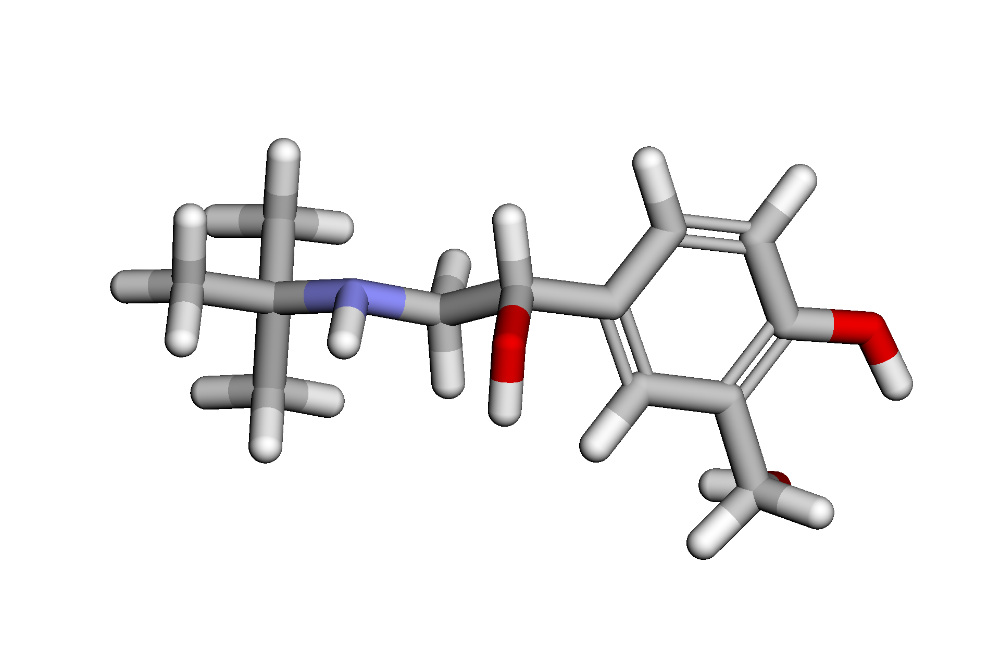
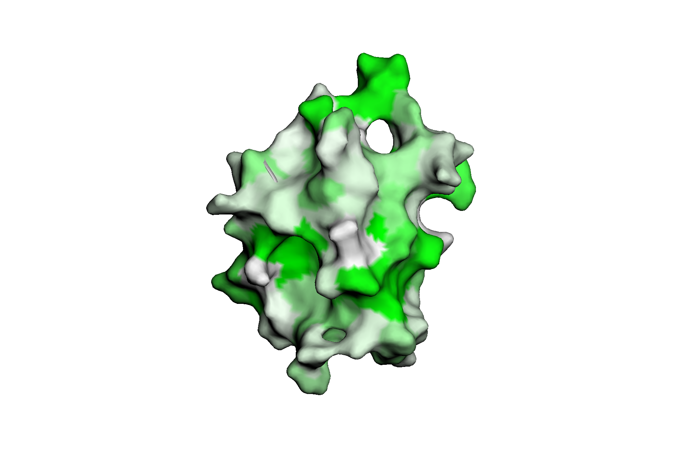
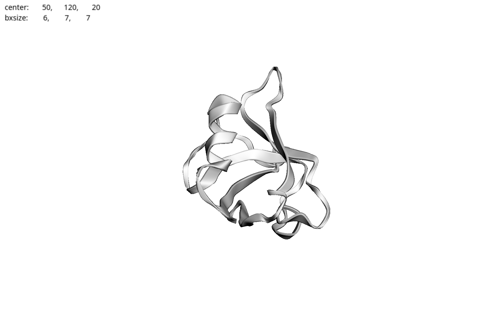
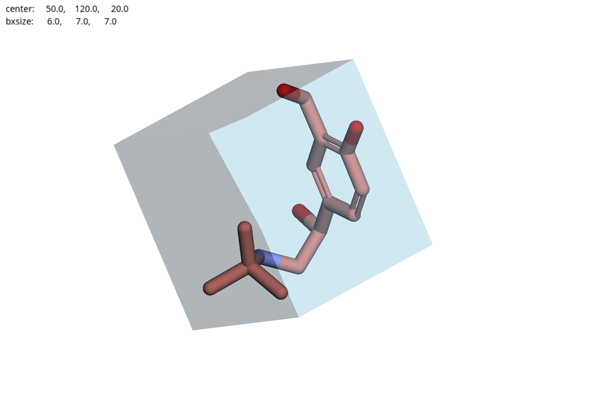

# Докинг лекарственных молекул: Альбутерол

## **Информация о препарате (лиганде)**

### **Действующее вещество**: Сальбутамол

### **Область применения**
Альбутерол (иное название Сальбутамол) это бронхорасширяющее средство, которое применяется для раскрытия дыхательных путей при заболеваниях легких, при которых спазмы могут препятствовать дыханию, например при астме. Также он используется для предотвращения нарушений дыхания, которые возникают при физической нагрузке.

### **Молекулярный механизм действия**
Третичная бутиловая группа в сальбутамоле позволяет ему стимулировать β2-рецепторы, которые являются преобладающими на гладких мышцах бронхов. Активация этих рецепторов заставляет аденилилциклазу превращать АТФ в цАМФ, начиная сигнальный каскад, который заканчивается ингибированием (подавлением) фосфорилирования миозина и снижением внутриклеточной концентрации ионов кальция (фосфорилирование миозина и ионы кальция необходимы для мышечных сокращений).

### **SMILES**: CC(C)(C)NCC(O)C1=CC(CO)=C(O)C=C1

## **Таргет** 
Beta 2 Adrenergic receptor

## [**Ноутбук**](basic_molecular_docking.ipynb)

## Результаты докинга
1. [PBD](./1GQ4_prot_A.pdb)
2. Box 
3. Docking 